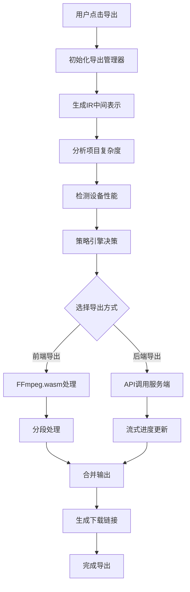
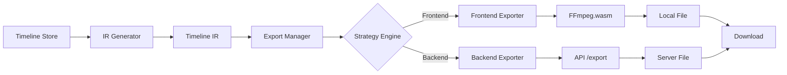

# SmartCut Frontend 视频导出功能详细文档

## 📋 目录

1. [系统架构概览](#系统架构概览)
2. [核心组件详解](#核心组件详解)
3. [导出流程](#导出流程)
4. [API 接口文档](#api接口文档)
5. [配置选项](#配置选项)
6. [使用示例](#使用示例)
7. [故障排除](#故障排除)
8. [性能优化](#性能优化)

## 🏗️ 系统架构概览

SmartCut Frontend 的导出系统采用分层架构设计，支持前端和后端两种导出方式：

```
导出系统架构
├── ExportManager (导出管理器) - 统一入口
│   ├── FrontendExporter (前端导出引擎) - 浏览器内导出
│   │   ├── FFmpegManager (FFmpeg.wasm管理)
│   │   └── SegmentProcessor (分段处理器)
│   ├── BackendExporter (后端导出客户端) - 服务端导出
│   │   ├── StreamAPI (流式API客户端)
│   │   └── ProgressTracker (进度跟踪)
│   └── StrategyEngine (策略决策引擎) - 智能选择导出方式
│       ├── DeviceDetection (设备检测)
│       ├── ProjectAnalyzer (项目分析)
│       └── PerformanceEstimator (性能估算)
├── IRGenerator (中间表示生成器) - 时间轴转换
├── ASSGenerator (ASS字幕生成器) - 字幕处理
└── UI Components (用户界面组件)
    ├── ExportButton (导出按钮)
    ├── ExportDialog (导出对话框)
    └── ProgressDialog (进度对话框)
```

## 🔧 核心组件详解

### 1. ExportManager (导出管理器)

**文件位置**: `apps/web/src/lib/export/export-manager.ts`

**主要功能**:

- 统一管理前端和后端导出
- 智能策略选择
- 进度跟踪和错误处理

**核心方法**:

```typescript
// 智能导出（推荐使用）
async smartExport(userPreference: UserPreference, onProgress?: (progress: ExportProgress) => void): Promise<ExportResult>

// 手动导出
async manualExport(options: ExportOptions, onProgress?: (progress: ExportProgress) => void): Promise<ExportResult>

// 获取导出策略建议
async getExportStrategy(userPreference: UserPreference): Promise<{ primary: ExportStrategy; alternatives: ExportStrategy[] }>

// 检查导出能力
async checkCapabilities(): Promise<{ frontend: boolean; backend: boolean; device: DeviceInfo }>
```

### 2. FrontendExporter (前端导出引擎)

**文件位置**: `apps/web/src/lib/export/frontend-exporter.ts`

**主要功能**:

- 使用 FFmpeg.wasm 在浏览器内处理视频
- 分段处理大型项目
- 本地隐私保护

**特点**:

- ✅ 完全本地处理，保护隐私
- ✅ 无需服务器资源
- ❌ 受浏览器性能限制
- ❌ 处理大文件时可能较慢

### 3. BackendExporter (后端导出客户端)

**文件位置**: `apps/web/src/lib/export/backend-exporter.ts`

**主要功能**:

- 调用服务端 API 进行视频处理
- 支持大型项目和高质量导出
- 流式进度更新

**特点**:

- ✅ 高性能处理
- ✅ 支持大文件和复杂项目
- ❌ 需要网络连接
- ❌ 数据需上传到服务器

### 4. StrategyEngine (策略决策引擎)

**文件位置**: `apps/web/src/lib/export/strategy-engine.ts`

**主要功能**:

- 分析设备性能和项目复杂度
- 智能选择最佳导出方式
- 提供性能预估和建议

**决策因素**:

- 设备性能（内存、CPU、GPU）
- 项目复杂度（文件大小、特效数量）
- 网络状况
- 用户隐私偏好

### 5. IRGenerator (中间表示生成器)

**文件位置**: `apps/web/src/lib/export/ir-generator.ts`

**主要功能**:

- 将时间轴数据转换为标准化中间表示(IR)
- 处理媒体文件引用和时间同步
- 生成 FFmpeg 可处理的数据结构

### 6. ASSGenerator (字幕生成器)

**文件位置**: `apps/web/src/lib/export/ass-generator.ts`

**主要功能**:

- 生成 ASS 格式字幕文件
- 支持样式和动画
- 处理 AI 生成的字幕数据

## 🔄 导出流程

### 智能导出流程



### 详细步骤说明

1. **初始化阶段**

   - 检查浏览器兼容性
   - 初始化 FFmpeg.wasm（如需要）
   - 验证项目数据完整性

2. **分析阶段**

   - 生成时间轴 IR 表示
   - 分析项目复杂度和资源需求
   - 检测设备性能和网络状况

3. **策略选择**

   - 根据分析结果选择最佳导出方式
   - 提供备选方案
   - 估算处理时间和文件大小

4. **执行导出**

   - 前端导出：分段处理，本地合并
   - 后端导出：上传 IR，服务端处理
   - 实时进度反馈

5. **完成处理**
   - 生成最终视频文件
   - 创建下载链接
   - 清理临时文件

## 📡 API 接口文档

### 后端导出 API

**端点**: `POST /api/export`

**请求体**:

```typescript
{
  ir: TimelineIR,           // 时间轴中间表示
  options: {
    quality: 'standard',    // 导出质量
    format: 'mp4',         // 输出格式
    codec: 'h264',         // 视频编码器
    subtitleMode: 'hard',  // 字幕模式
    // ... 其他选项
  }
}
```

**响应**:

- 成功：返回视频文件流
- 失败：返回错误信息 JSON

### 下载 API

**端点**: `GET /api/export/download/[id]`

**功能**: 下载已完成的导出文件

**响应**: 视频文件流或错误信息

## ⚙️ 配置选项

### 导出质量级别

```typescript
type ExportQuality = 'preview' | 'standard' | 'professional'

// 质量配置
const qualitySettings = {
  preview: {
    crf: 28, // 较低质量，快速导出
    videoBitrate: '2M',
    audioBitrate: '128k',
    preset: 'veryfast',
  },
  standard: {
    crf: 23, // 平衡质量和速度
    videoBitrate: '5M',
    audioBitrate: '192k',
    preset: 'medium',
  },
  professional: {
    crf: 18, // 高质量，较慢导出
    videoBitrate: '15M',
    audioBitrate: '320k',
    preset: 'slow',
  },
}
```

### 隐私级别

```typescript
type PrivacyLevel = 'strict' | 'balanced' | 'performance'

// strict: 仅本地处理，不上传任何数据
// balanced: 根据项目复杂度智能选择
// performance: 优先使用服务端处理以获得最佳性能
```

### 用户偏好设置

```typescript
interface UserPreference {
  privacy: PrivacyLevel // 隐私级别
  quality: ExportQuality // 首选质量
  allowCloudProcessing: boolean // 是否允许云端处理
  preferredFormat?: ExportFormat // 首选格式
  preferredCodec?: VideoCodec // 首选编码器
  method?: ExportMethod // 强制指定导出方式
}
```

## 💻 使用示例

### 1. 基础快速导出

```typescript
import { exportManager } from '@/lib/export'

// 使用默认设置快速导出
const result = await exportManager.smartExport({
  privacy: 'balanced',
  quality: 'standard',
  allowCloudProcessing: true,
})

if (result.success) {
  console.log('导出完成:', result.url)
  // 自动下载
  const a = document.createElement('a')
  a.href = result.url
  a.download = result.filename
  a.click()
}
```

### 2. 带进度监听的导出

```typescript
const result = await exportManager.smartExport(
  {
    privacy: 'balanced',
    quality: 'standard',
  },
  (progress) => {
    console.log(`进度: ${Math.round(progress.overall * 100)}%`)
    console.log(`阶段: ${progress.stage}`)
    console.log(`消息: ${progress.message}`)

    // 更新UI进度条
    updateProgressBar(progress.overall)
  }
)
```

### 3. 手动指定导出选项

```typescript
// 强制使用前端导出
const frontendResult = await exportManager.manualExport({
  quality: 'professional',
  method: 'frontend',
  format: 'mp4',
  codec: 'h264',
  subtitleMode: 'hard',
  useGPU: true,
})

// 强制使用后端导出
const backendResult = await exportManager.manualExport({
  quality: 'professional',
  method: 'backend',
  format: 'mp4',
  codec: 'h265',
  subtitleMode: 'soft',
})
```

### 4. 预览导出设置

```typescript
// 获取导出策略建议
const preview = await exportManager.previewExport({
  privacy: 'balanced',
  quality: 'standard',
})

console.log('推荐策略:', preview.strategy)
console.log('项目分析:', preview.projectAnalysis)
console.log('预估结果:', preview.estimatedResult)
console.log('警告信息:', preview.warnings)
```

### 5. 检查导出能力

```typescript
const capabilities = await exportManager.checkCapabilities()

console.log('前端导出支持:', capabilities.frontend)
console.log('后端导出支持:', capabilities.backend)
console.log('设备信息:', capabilities.device)
```

## 🔧 故障排除

### 常见问题及解决方案

#### 1. 前端导出失败

**问题**: FFmpeg.wasm 加载失败或内存不足

**解决方案**:

```typescript
// 检查浏览器兼容性
const capabilities = await exportManager.checkCapabilities()
if (!capabilities.frontend) {
  // 回退到后端导出
  const result = await exportManager.manualExport({
    method: 'backend',
    quality: 'standard',
  })
}
```

#### 2. 后端导出超时

**问题**: 网络连接问题或服务器负载过高

**解决方案**:

```typescript
// 使用更低的质量设置
const result = await exportManager.smartExport({
  privacy: 'performance',
  quality: 'preview', // 降低质量以减少处理时间
})
```

#### 3. 内存不足错误

**问题**: 项目过于复杂，超出设备处理能力

**解决方案**:

```typescript
// 启用分段处理
const result = await exportManager.manualExport({
  method: 'frontend',
  quality: 'standard',
  segmentDuration: 30, // 30秒分段
  maxConcurrency: 1, // 降低并发数
})
```

### 错误代码说明

| 错误代码     | 说明              | 解决方案                       |
| ------------ | ----------------- | ------------------------------ |
| `EXPORT_001` | FFmpeg 初始化失败 | 检查浏览器兼容性，尝试后端导出 |
| `EXPORT_002` | 内存不足          | 降低质量设置或启用分段处理     |
| `EXPORT_003` | 网络连接失败      | 检查网络连接，尝试前端导出     |
| `EXPORT_004` | 服务器错误        | 稍后重试或联系技术支持         |
| `EXPORT_005` | 项目数据无效      | 检查时间轴数据完整性           |

## ⚡ 性能优化

### 1. 设备性能优化

```typescript
// 根据设备性能自动调整设置
const deviceInfo = await detectDeviceInfo()

const optimizedPreference: UserPreference = {
  privacy: 'balanced',
  quality: deviceInfo.performanceLevel === 'high' ? 'professional' : 'standard',
  allowCloudProcessing: deviceInfo.performanceLevel === 'low',
}
```

### 2. 分段处理优化

```typescript
// 大项目分段处理
const projectAnalysis = analyzeProject(ir)

const segmentDuration = projectAnalysis.complexityScore > 80 ? 20 : 60
const maxConcurrency = deviceInfo.cpuCores > 4 ? 2 : 1

const result = await exportManager.manualExport({
  method: 'frontend',
  segmentDuration,
  maxConcurrency,
  useGPU: deviceInfo.supportsWebCodecs,
})
```

### 3. 内存管理

```typescript
// 监控内存使用
const performanceAnalysis = await performanceAnalyzer.analyzeExportPerformance(
  ir
)

if (performanceAnalysis.estimatedMemoryUsage > 1.5 * 1024 * 1024 * 1024) {
  // 超过1.5GB，使用后端导出
  const result = await exportManager.manualExport({
    method: 'backend',
    quality: 'standard',
  })
}
```

### 4. 缓存优化

```typescript
// 启用代理媒体以减少处理时间
const result = await exportManager.manualExport({
  method: 'frontend',
  useProxy: true, // 使用低分辨率代理文件
  quality: 'standard',
})
```

## 📊 监控和分析

### 导出性能监控

```typescript
// 获取详细的性能分析
const analysis = await performanceAnalyzer.analyzeExportPerformance(ir)

console.log('复杂度评分:', analysis.complexityScore)
console.log('预估内存使用:', analysis.estimatedMemoryUsage)
console.log('预估处理时间:', analysis.estimatedProcessingTime)
console.log('推荐导出方式:', analysis.recommendedMethod)
```

### 导出统计信息

```typescript
// 导出完成后获取统计信息
const result = await exportManager.smartExport(preference)

if (result.stats) {
  console.log('总帧数:', result.stats.totalFrames)
  console.log('处理帧数:', result.stats.processedFrames)
  console.log('平均速度:', result.stats.averageSpeed)
  console.log('峰值内存:', result.stats.peakMemoryUsage)
  console.log('最终文件大小:', result.stats.finalFileSize)
}
```

## 🔮 未来规划

### 即将推出的功能

1. **增量导出**: 只重新处理修改的部分
2. **云端协作**: 多人协作项目的导出同步
3. **自定义预设**: 用户自定义导出配置
4. **批量导出**: 同时导出多个项目
5. **实时预览**: 导出过程中的实时预览

### 技术改进

1. **WebCodecs 支持**: 利用浏览器原生编码能力
2. **WebGPU 加速**: GPU 加速的视频处理
3. **流式处理**: 边处理边下载的流式导出
4. **智能压缩**: AI 驱动的智能视频压缩

## 🛠️ 技术实现细节

### 文件结构说明

```
apps/web/src/lib/export/
├── index.ts                    # 导出系统统一入口
├── export-manager.ts           # 核心导出管理器
├── frontend-exporter.ts        # 前端导出引擎
├── backend-exporter.ts         # 后端导出客户端
├── strategy-engine.ts          # 策略决策引擎
├── device-detection.ts         # 设备性能检测
├── project-analyzer.ts         # 项目复杂度分析
├── performance-analyzer.ts     # 性能分析器
├── ir-generator.ts            # IR中间表示生成器
├── ass-generator.ts           # ASS字幕生成器
├── ffmpeg-manager.ts          # FFmpeg管理器
├── ai-video-exporter.ts       # AI视频导出器
├── simple-exporter.ts         # 简化导出器
├── README.md                  # 导出系统说明
└── __tests__/                 # 测试文件
    └── export-system.test.ts
```

### 核心数据流



### 类型定义详解

#### ExportOptions 完整配置

```typescript
interface ExportOptions {
  // 基本设置
  quality: ExportQuality // 'preview' | 'standard' | 'professional'
  method: ExportMethod // 'frontend' | 'backend' | 'hybrid'

  // 输出设置
  format: ExportFormat // 'mp4' | 'webm' | 'mov'
  codec: VideoCodec // 'h264' | 'h265' | 'vp9' | 'av1'
  bitrate?: number // 视频码率 (kbps)
  fps?: number // 帧率

  // 分辨率设置
  width?: number // 输出宽度
  height?: number // 输出高度
  maintainAspectRatio?: boolean // 保持宽高比

  // 字幕设置
  subtitleMode: SubtitleMode // 'hard' | 'soft' | 'none'
  fontDir?: string // 字体目录路径

  // 高级设置
  useGPU?: boolean // GPU加速
  useProxy?: boolean // 使用代理媒体
  segmentDuration?: number // 分段时长(秒)
  maxConcurrency?: number // 最大并发数

  // 质量控制
  crf?: number // 恒定质量因子 (0-51)
  preset?: string // 编码预设

  // 回调函数
  onProgress?: (progress: ExportProgress) => void
  onComplete?: (result: ExportResult) => void
  onError?: (error: ExportError) => void
  onWarning?: (warning: string) => void
}
```

#### ExportProgress 进度信息

```typescript
interface ExportProgress {
  overall: number // 总体进度 (0-1)
  stage: ExportStage // 当前阶段
  message?: string // 进度消息
  elapsedTime: number // 已用时间(秒)
  estimatedTimeRemaining?: number // 预估剩余时间(秒)
  currentSegment?: number // 当前处理段
  totalSegments?: number // 总段数

  // 详细进度
  details?: {
    preparation?: number // 准备阶段进度
    processing?: number // 处理阶段进度
    encoding?: number // 编码阶段进度
    finalizing?: number // 完成阶段进度
  }

  // 性能信息
  performance?: {
    memoryUsage: number // 当前内存使用
    cpuUsage: number // CPU使用率
    processingSpeed: number // 处理速度 (fps)
  }
}
```

### AI 视频导出器详解

**文件位置**: `apps/web/src/lib/export/ai-video-exporter.ts`

AI 视频导出器是专门为 AI 剪辑功能设计的导出器，具有以下特点：

#### 主要功能

1. **AI 剪辑数据处理**: 直接处理 AI 生成的剪辑计划
2. **智能字幕集成**: 自动添加 AI 生成的字幕
3. **优化的导出流程**: 针对 AI 剪辑结果优化的处理流程

#### 核心方法

```typescript
class AIVideoExporter {
  // 检查是否可以导出AI剪辑结果
  static canExport(): { canExport: boolean; reason?: string }

  // 导出AI剪辑的视频
  static async exportAIVideo(
    options?: Partial<ExportOptions>
  ): Promise<ExportResult>

  // 生成AI剪辑的IR表示
  static generateAIClipsIR(): TimelineIR

  // 添加AI字幕到导出
  static async addAISubtitles(ir: TimelineIR): Promise<TimelineIR>
}
```

#### 使用示例

```typescript
import { aiVideoExporter } from '@/lib/export/ai-video-exporter'

// 检查是否可以导出
const canExport = aiVideoExporter.canExport()
if (canExport.canExport) {
  // 执行AI视频导出
  const result = await aiVideoExporter.exportAIVideo({
    quality: 'standard',
    subtitleMode: 'hard',
  })

  if (result.success) {
    console.log('AI视频导出完成:', result.url)
  }
} else {
  console.log('无法导出:', canExport.reason)
}
```

### 字幕系统详解

#### ASS 字幕生成器

**文件位置**: `apps/web/src/lib/export/ass-generator.ts`

ASS 字幕生成器负责将时间轴中的文本元素转换为 ASS 格式字幕文件：

```typescript
class ASSGenerator {
  // 生成完整的ASS字幕文件
  static generateASS(ir: TimelineIR): string

  // 生成ASS样式定义
  static generateStyles(textElements: TextElement[]): ASSStyle[]

  // 生成ASS对话行
  static generateDialogues(textElements: TextElement[]): ASSDialogue[]

  // 时间格式转换
  static formatTime(seconds: number): string
}
```

#### ASS 文件结构

```ass
[Script Info]
Title: SmartCut Frontend Export
ScriptType: v4.00+

[V4+ Styles]
Format: Name, Fontname, Fontsize, PrimaryColour, SecondaryColour, OutlineColour, BackColour, Bold, Italic, Underline, StrikeOut, ScaleX, ScaleY, Spacing, Angle, BorderStyle, Outline, Shadow, Alignment, MarginL, MarginR, MarginV, Encoding
Style: Default,Arial,20,&H00FFFFFF,&H000000FF,&H00000000,&H80000000,0,0,0,0,100,100,0,0,1,2,0,2,10,10,10,1

[Events]
Format: Layer, Start, End, Style, Name, MarginL, MarginR, MarginV, Effect, Text
Dialogue: 0,0:00:00.00,0:00:05.00,Default,,0,0,0,,这是第一行字幕
Dialogue: 0,0:00:05.00,0:00:10.00,Default,,0,0,0,,这是第二行字幕
```

### 性能优化策略

#### 1. 内存管理

```typescript
// 内存监控和清理
class MemoryManager {
  private static maxMemoryUsage = 1.5 * 1024 * 1024 * 1024 // 1.5GB

  static checkMemoryUsage(): number {
    if ('memory' in performance) {
      return (performance as any).memory.usedJSHeapSize
    }
    return 0
  }

  static async cleanupIfNeeded(): Promise<void> {
    const usage = this.checkMemoryUsage()
    if (usage > this.maxMemoryUsage) {
      // 触发垃圾回收
      if ('gc' in window) {
        ;(window as any).gc()
      }

      // 清理缓存
      await this.clearCaches()
    }
  }

  private static async clearCaches(): Promise<void> {
    // 清理媒体缓存
    // 清理临时文件
    // 释放不必要的对象引用
  }
}
```

#### 2. 分段处理策略

```typescript
// 智能分段算法
class SegmentationStrategy {
  static calculateOptimalSegments(
    ir: TimelineIR,
    deviceInfo: DeviceInfo
  ): TimelineSegment[] {
    const totalDuration = ir.duration
    const complexity = this.calculateComplexity(ir)
    const deviceCapability = this.assessDeviceCapability(deviceInfo)

    // 根据复杂度和设备能力计算最优分段
    const segmentDuration = this.calculateSegmentDuration(
      complexity,
      deviceCapability
    )
    const segments: TimelineSegment[] = []

    for (let start = 0; start < totalDuration; start += segmentDuration) {
      const end = Math.min(start + segmentDuration, totalDuration)
      segments.push({
        id: `segment_${segments.length}`,
        startTime: start,
        endTime: end,
        duration: end - start,
        // ... 其他属性
      })
    }

    return segments
  }

  private static calculateComplexity(ir: TimelineIR): number {
    // 计算项目复杂度
    let score = 0
    score += ir.video.length * 10 // 视频轨道权重
    score += ir.audio.length * 5 // 音频轨道权重
    score += ir.texts.length * 2 // 文本轨道权重
    score += ir.transitions.length * 15 // 转场效果权重
    return score
  }
}
```

#### 3. 并发处理优化

```typescript
// 并发任务管理
class ConcurrencyManager {
  private static maxConcurrency = 2
  private static activeJobs = 0
  private static jobQueue: (() => Promise<void>)[] = []

  static async executeWithLimit<T>(job: () => Promise<T>): Promise<T> {
    return new Promise((resolve, reject) => {
      const wrappedJob = async () => {
        try {
          this.activeJobs++
          const result = await job()
          resolve(result)
        } catch (error) {
          reject(error)
        } finally {
          this.activeJobs--
          this.processQueue()
        }
      }

      if (this.activeJobs < this.maxConcurrency) {
        wrappedJob()
      } else {
        this.jobQueue.push(wrappedJob)
      }
    })
  }

  private static processQueue(): void {
    if (this.jobQueue.length > 0 && this.activeJobs < this.maxConcurrency) {
      const nextJob = this.jobQueue.shift()
      if (nextJob) {
        nextJob()
      }
    }
  }
}
```

### 错误处理和恢复

#### 错误分类和处理策略

```typescript
// 错误处理器
class ExportErrorHandler {
  static handleError(error: any, context: ExportContext): ExportError {
    const exportError: ExportError = {
      code: this.categorizeError(error),
      message: error.message || '未知错误',
      stage: context.currentStage,
      recoverable: this.isRecoverable(error),
      suggestions: this.getSuggestions(error),
      context: {
        currentSegment: context.currentSegment,
        memoryUsage: context.memoryUsage,
        timeElapsed: context.timeElapsed,
      },
    }

    return exportError
  }

  private static categorizeError(error: any): string {
    if (error.name === 'QuotaExceededError') return 'EXPORT_002' // 内存不足
    if (error.message?.includes('network')) return 'EXPORT_003' // 网络错误
    if (error.message?.includes('ffmpeg')) return 'EXPORT_001' // FFmpeg错误
    return 'EXPORT_000' // 通用错误
  }

  private static isRecoverable(error: any): boolean {
    // 判断错误是否可恢复
    const recoverableErrors = ['EXPORT_003', 'EXPORT_004']
    return recoverableErrors.includes(this.categorizeError(error))
  }

  private static getSuggestions(error: any): string[] {
    const code = this.categorizeError(error)
    const suggestions: Record<string, string[]> = {
      EXPORT_001: ['检查浏览器兼容性', '尝试使用后端导出'],
      EXPORT_002: ['降低导出质量', '启用分段处理', '关闭其他标签页'],
      EXPORT_003: ['检查网络连接', '尝试使用前端导出'],
      EXPORT_004: ['稍后重试', '联系技术支持'],
    }

    return suggestions[code] || ['重新尝试导出']
  }
}
```

#### 自动恢复机制

```typescript
// 自动恢复管理器
class RecoveryManager {
  private static maxRetries = 3
  private static retryDelay = 5000 // 5秒

  static async executeWithRetry<T>(
    operation: () => Promise<T>,
    context: ExportContext
  ): Promise<T> {
    let lastError: any

    for (let attempt = 1; attempt <= this.maxRetries; attempt++) {
      try {
        return await operation()
      } catch (error) {
        lastError = error
        const exportError = ExportErrorHandler.handleError(error, context)

        if (!exportError.recoverable || attempt === this.maxRetries) {
          throw exportError
        }

        console.log(`导出失败，第${attempt}次重试 (${this.maxRetries}次中)...`)
        await this.delay(this.retryDelay * attempt) // 指数退避

        // 在重试前进行清理和优化
        await this.prepareForRetry(context)
      }
    }

    throw lastError
  }

  private static delay(ms: number): Promise<void> {
    return new Promise((resolve) => setTimeout(resolve, ms))
  }

  private static async prepareForRetry(context: ExportContext): Promise<void> {
    // 清理内存
    await MemoryManager.cleanupIfNeeded()

    // 降低质量设置
    if (context.retryCount > 1) {
      context.options.quality = 'preview'
      context.options.segmentDuration = Math.min(
        context.options.segmentDuration || 60,
        30
      )
    }
  }
}
```

---

## 📞 技术支持

如果在使用导出功能时遇到问题，请：

1. 查看浏览器控制台的错误信息
2. 检查网络连接状态
3. 尝试降低导出质量设置
4. 联系技术支持团队

### 调试工具

```typescript
// 导出调试工具
class ExportDebugger {
  static enableDebugMode(): void {
    localStorage.setItem('export_debug', 'true')
    console.log('导出调试模式已启用')
  }

  static logExportInfo(ir: TimelineIR, options: ExportOptions): void {
    if (localStorage.getItem('export_debug') === 'true') {
      console.group('导出调试信息')
      console.log('IR数据:', ir)
      console.log('导出选项:', options)
      console.log('设备信息:', detectDeviceInfo())
      console.groupEnd()
    }
  }

  static generateDiagnosticReport(): string {
    // 生成诊断报告
    const report = {
      timestamp: new Date().toISOString(),
      userAgent: navigator.userAgent,
      deviceInfo: detectDeviceInfo(),
      memoryInfo: MemoryManager.checkMemoryUsage(),
      // ... 其他诊断信息
    }

    return JSON.stringify(report, null, 2)
  }
}
```

### 常用调试命令

```typescript
// 在浏览器控制台中使用以下命令进行调试

// 启用调试模式
ExportDebugger.enableDebugMode()

// 生成诊断报告
const report = ExportDebugger.generateDiagnosticReport()
console.log(report)

// 检查导出能力
const capabilities = await exportManager.checkCapabilities()
console.log('导出能力:', capabilities)

// 分析项目复杂度
const ir = IRGenerator.generateIR()
const analysis = analyzeProject(ir)
console.log('项目分析:', analysis)

// 获取设备信息
const deviceInfo = await detectDeviceInfo()
console.log('设备信息:', deviceInfo)
```

## 📚 相关文档

### 内部文档链接

- [导出系统 README](apps/web/src/lib/export/README.md) - 导出系统概览
- [视频导出方案](视频导出方案.txt) - 详细技术方案
- [类型定义](apps/web/src/types/export.ts) - 完整类型定义
- [测试文件](apps/web/src/lib/export/__tests__/) - 单元测试和集成测试

### 外部参考

- [FFmpeg.wasm 文档](https://ffmpegwasm.netlify.app/) - 前端视频处理
- [ASS 字幕格式规范](http://docs.aegisub.org/3.2/ASS_Tags/) - 字幕格式标准
- [WebCodecs API](https://developer.mozilla.org/en-US/docs/Web/API/WebCodecs_API) - 浏览器编码 API
- [Web Workers](https://developer.mozilla.org/en-US/docs/Web/API/Web_Workers_API) - 多线程处理

## 🔄 版本历史

### v1.0.0 (2025-01-20)

- ✅ 初始版本发布
- ✅ 前端和后端导出支持
- ✅ 智能策略选择
- ✅ AI 视频导出器
- ✅ ASS 字幕生成
- ✅ 性能优化和错误处理

### 计划中的版本

#### v1.1.0 (计划中)

- 🔄 增量导出功能
- 🔄 WebCodecs API 支持
- 🔄 更好的进度反馈
- 🔄 自定义导出预设

#### v1.2.0 (计划中)

- 🔄 WebGPU 加速
- 🔄 流式导出
- 🔄 批量导出
- 🔄 云端协作

## 🤝 贡献指南

### 如何贡献

1. **报告问题**: 在 GitHub Issues 中报告 bug 或提出功能请求
2. **提交代码**: Fork 项目，创建 feature 分支，提交 Pull Request
3. **改进文档**: 帮助完善文档和示例代码
4. **性能优化**: 提供性能优化建议和实现

### 开发环境设置

```bash
# 克隆项目
git clone https://github.com/your-org/opencut.git
cd opencut

# 安装依赖
npm install

# 启动开发服务器
npm run dev

# 运行测试
npm run test

# 运行导出系统测试
npm run test:export
```

### 代码规范

- 使用 TypeScript 进行类型安全开发
- 遵循 ESLint 和 Prettier 配置
- 编写单元测试和集成测试
- 添加详细的 JSDoc 注释
- 遵循现有的代码结构和命名规范

### 测试指南

```typescript
// 示例测试用例
describe('Export System', () => {
  it('should export video successfully', async () => {
    const result = await exportManager.smartExport({
      privacy: 'balanced',
      quality: 'standard',
    })

    expect(result.success).toBe(true)
    expect(result.url).toBeDefined()
    expect(result.size).toBeGreaterThan(0)
  })

  it('should handle export errors gracefully', async () => {
    // 模拟错误条件
    const mockIR = createInvalidIR()

    await expect(
      exportManager.manualExport({
        method: 'frontend',
        quality: 'standard',
      })
    ).rejects.toThrow()
  })
})
```

## 📊 性能基准

### 导出性能参考

| 项目类型 | 时长      | 复杂度 | 前端导出时间 | 后端导出时间 | 推荐方式  |
| -------- | --------- | ------ | ------------ | ------------ | --------- |
| 简单剪辑 | 1-5 分钟  | 低     | 30-60 秒     | 15-30 秒     | 前端      |
| 标准项目 | 5-15 分钟 | 中     | 2-5 分钟     | 1-2 分钟     | 智能选择  |
| 复杂项目 | 15 分钟+  | 高     | 5-15 分钟    | 2-5 分钟     | 后端      |
| AI 剪辑  | 任意      | 中-高  | 根据内容     | 根据内容     | AI 导出器 |

### 设备性能要求

#### 最低要求

- **内存**: 4GB RAM
- **浏览器**: Chrome 90+, Firefox 88+, Safari 14+
- **网络**: 1Mbps (后端导出)

#### 推荐配置

- **内存**: 8GB+ RAM
- **CPU**: 4 核心+
- **浏览器**: 最新版本
- **网络**: 10Mbps+ (后端导出)

#### 最佳体验

- **内存**: 16GB+ RAM
- **CPU**: 8 核心+, 支持硬件加速
- **GPU**: 支持 WebGL 2.0
- **网络**: 50Mbps+ (后端导出)

---

**文档版本**: v1.0.0
**最后更新**: 2025-01-20
**维护者**: SmartCut Frontend 开发团队

---

## 📄 许可证

本项目采用 MIT 许可证。详见 [LICENSE](LICENSE) 文件。

## 🙏 致谢

感谢以下开源项目和贡献者：

- [FFmpeg.wasm](https://ffmpegwasm.netlify.app/) - 浏览器中的视频处理
- [Next.js](https://nextjs.org/) - React 框架
- [Zustand](https://github.com/pmndrs/zustand) - 状态管理
- [Tailwind CSS](https://tailwindcss.com/) - CSS 框架
- 所有为 SmartCut Frontend 项目贡献代码的开发者

---

_这份文档将持续更新，以反映导出系统的最新功能和改进。如有任何问题或建议，请随时联系我们。_
